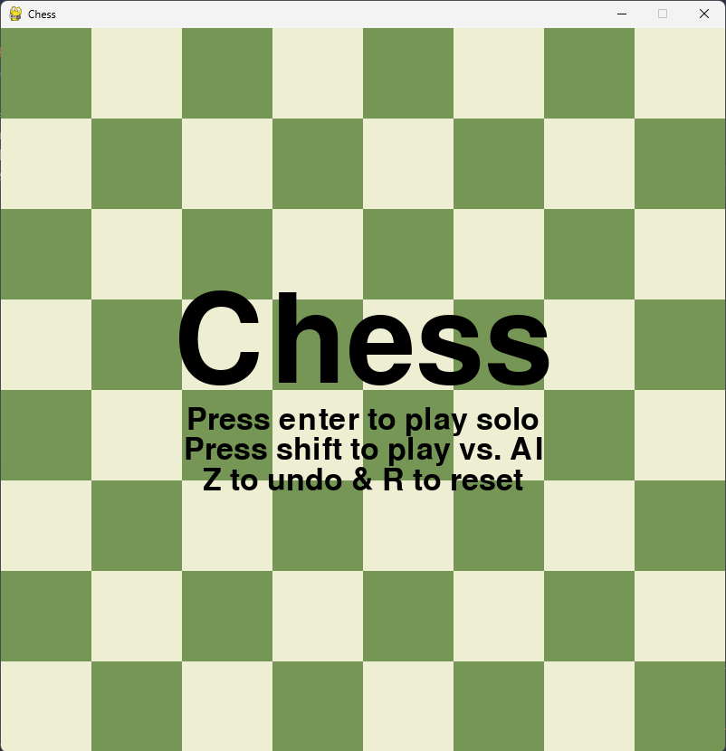
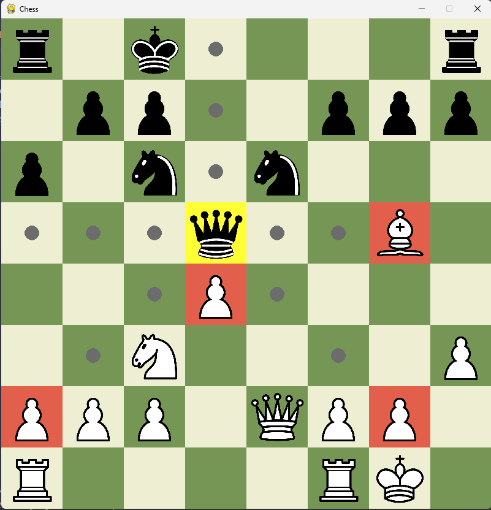
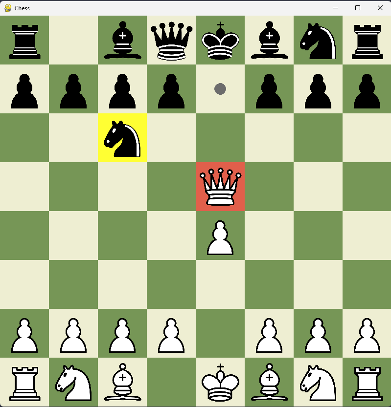

# Python Chess Engine

## Chess engine developed using python, pygame, and numpy

Python chess engine minus the smart engine part (currently just greedy). Have move generation most of the way there, with a small known bug where some pins work and others don't. Also includes some quality of life features like undoing, resetting the board, FEN string support, and different title and pawn promotion screens.

Shortcuts:
* z -> undo
* t -> toggle between AI & solo play
* r -> reset board to starting position

